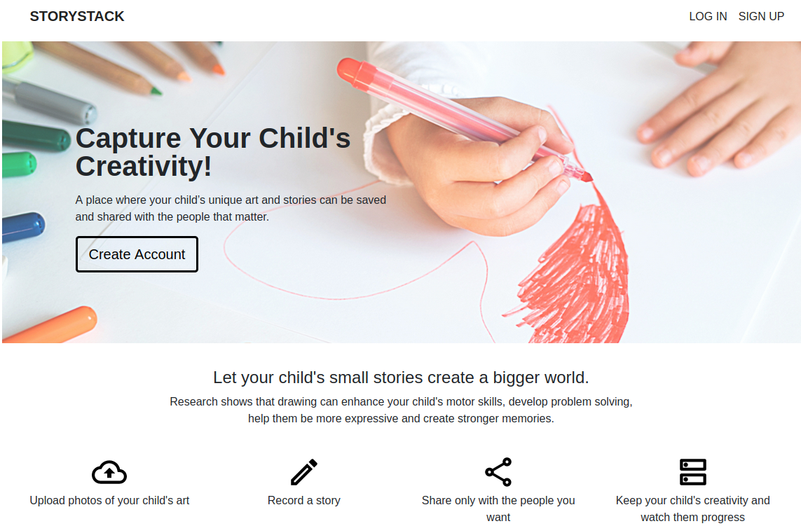

# StoryStack

StoryStack is a Python app for users to save and share their child’s unique art and stories. Users can create accounts to log in, upload photos of their child's artwork and write an accompanying story. Users can share these stories with others using the Mailgun API.

The website is built with a Django backend and data is stored and managed through SQLite. The frontend is Django-templated and uses Bootstrap 4.4.1 CSS.


## Getting Started

*Prereq*: [You have Pipenv
installed.](https://github.com/kickstartcoding/pipenv-getting-started)


From cloned repo, activate a Pipenv virtual environment:

```
pipenv shell
```


Install dependencies:

```
pipenv install --dev
```

Create SQLite database:

```
python3 manage.py migrate
```


Start up server:

```
python3 manage.py runserver
```

## Built With
This project is based on the [Kickstart Coding Djano Project Starter](https://github.com/kickstartcoding/django-kcproject-starter)


## Collaborators
* [https://github.com/tman18](https://github.com/tman18)
* [https://github.com/KevinWong1](https://github.com/KevinWong1)
* [https://github.com/patrick-ware](https://github.com/patrick-ware)
